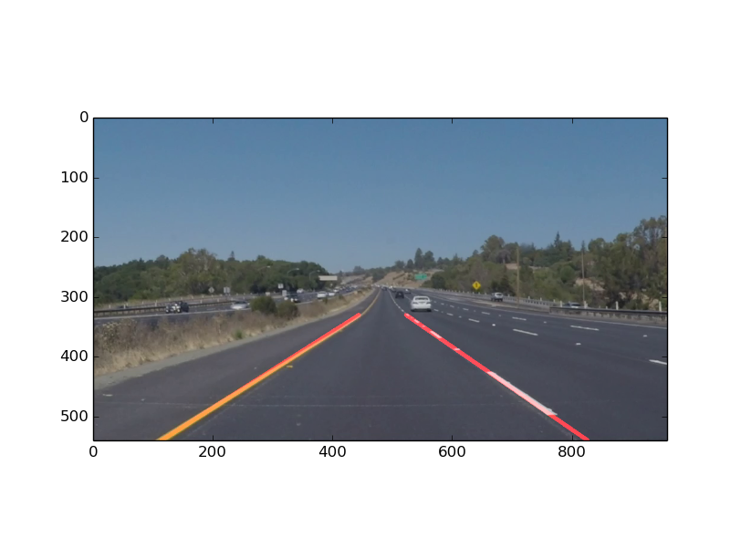

#**Finding Lane Lines on the Road -Jack Qian** 

###1. Describe your pipeline. As part of the description, explain how you modified the draw_lines() function.

My pipeline consisted of 4 steps. First, I read the image from the vedio using vediopy and transform it to the gray one. Second, edge detection was carried out using canny detector. Then, hough transform was used to detect lines in the road. In the end, we fuse all the detected lines into 2 lines according to their slopes.

###2. Identify potential shortcomings with your current pipeline

Potential shortcoming would be what would happen when the car change the current lane, the algorithm will return the wrong result.

###3. Suggest possible improvements to your pipeline

A possible improvement would be to add the detection of muti lane lines.
